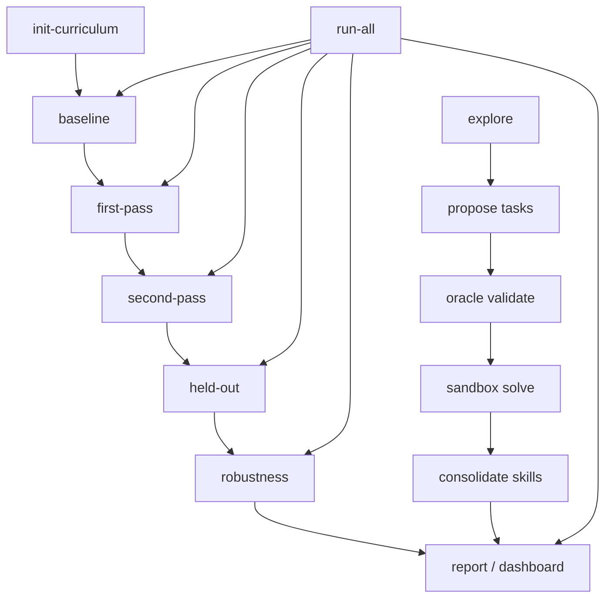

# Use cases — Evolutionary Coding Agent

This document describes who the project is for, which pain points it addresses, and step-by-step guides for common workflows.

For implementation history and metrics, see [memory.md](memory.md) and [walkthrough.md](walkthrough.md).

---

## What problem does this project solve?

Most coding agents treat every task as a fresh start. They cannot **learn reusable skills**, **measure whether learning helped**, or **explore new practice tasks on their own**. This project implements an evolutionary loop: baseline → learn → freeze memory → re-test → generalize → stress-test → report evidence.

---

## User personas

| Persona | Goal |
|---------|------|
| **ML / agent researcher** | Prove that memory improves coding performance with reproducible metrics (PG, SG, GG, p-values) |
| **Platform engineer** | Run a safe sandbox pipeline (Docker-only, budget caps, oracle gates) without polluting production |
| **Curriculum designer** | Let the agent propose and validate new Python tasks in zones of proximal development |
| **Reliability engineer** | Detect memory poisoning, negative transfer, and skill corruption before they break downstream runs |

---

## User stories and pain points

### 1. “I need evidence that memory helps, not anecdotes”

**Pain point:** Ad-hoc agent demos show one-off wins but no controlled comparison between memoryless baseline and learned second pass.

**User story:** As a researcher, I want to run baseline and second-pass evaluation across multiple seeds so that I can compute Plasticity Gain, Stability Gain, and paired t-test p-values.

**How the project addresses it:**
- `run-all` executes baseline → first pass → second pass → held-out → robustness → dashboard
- Dashboard shows H1 (second pass vs baseline) and H2 (stability) with p-values
- Default 6 seeds (`42–47`) for statistical rigor; override with `--seeds`

#### Dr. Lin scenario: does memory help — with numbers, not vibes?

**Scenario:** Dr. Lin wears her **researcher hat**. Explore and skill banks (§2, §3) show the agent *can* learn — but does memory **improve scores** in a controlled way? She runs the full evolutionary pipeline:

```powershell
cd D:\AI_project\Evolutionary-Coding-Agent
.venv\Scripts\Activate.ps1
$env:GEMINI_API_KEY = "your-key"
.venv\Scripts\python run.py init-curriculum
.venv\Scripts\python run.py run-all
# Or smoke test: python run.py run-all --seeds 42,43
```

Each **seed** repeats the same curriculum with a fixed random source — like running the experiment multiple times with different dice rolls, so results are not a single lucky demo.

**The controlled comparison (three passes per task)**

| Pass | Memory | Question answered |
|------|--------|-------------------|
| **Baseline** (`B`) | Off — memoryless | How well does the agent score with **no** prior learning? |
| **First pass** (`F`) | On — learns & writes skills/insights | Does access to memory **help while learning**? |
| **Second pass** (`S`) | Frozen snapshot — no new learning | After learning, is performance **stable** when memory stops updating? |

Held-out tasks (not in training) measure **generalization** (`GG`). Robustness tasks stress-test poisoning and negative transfer.

**What gets measured — Evolutionary Loop metrics**

| Metric | Formula (intuition) | Latest `run-all` (6 seeds, Jun 17 - DeepSeek) | Historical `run-all` (6 seeds, Jun 16 - Gemini) |
|--------|---------------------|------------------------------------------------|--------------------------------------------------|
| **Plasticity Gain (PG)** | First pass vs baseline — did memory **help while learning**? | **0.000** (mean) | +0.125 (mean) |
| **Stability Gain (SG)** | Second pass vs first pass — did scores **hold or improve** after freeze? | **0.000** (mean) | −0.042 (mean) |
| **Generalization Gain (GG)** | Held-out vs baseline — does learning **transfer** to unseen tasks? | **0.000** (mean) | +0.083 (mean) |

Training tasks in the loop: `SUB_001`, `SUB_002`, `SUB_003`, `COMPLEX_001`.

**Per training task (latest DeepSeek run, 6-seed means)**

| Task | Baseline | 1st pass | 2nd pass | PG | SG |
|------|----------|----------|----------|-----|-----|
| SUB_001 (email) | 9.00 | 9.00 | 9.00 | 0.00 | 0.00 |
| SUB_002 (math) | 9.00 | 9.00 | 9.00 | 0.00 | 0.00 |
| SUB_003 (JSON) | 9.00 | 9.00 | 9.00 | 0.00 | 0.00 |
| COMPLEX_001 (logs) | 9.00 | 9.00 | 9.00 | 0.00 | 0.00 |
| HELDOUT_001 (SQL) | 9.00 | — | — | GG **0.00** | — |

**Pre-registered hypotheses on the dashboard (Phase 6 - DeepSeek 6-seed)**

| Hypothesis | Claim | Latest run (Jun 17 - DeepSeek) |
|------------|-------|---------------------------------|
| **H1** | Mean second-pass score > mean baseline | Mean B = **9.00**, mean S = **9.00**, Δ (S − B) = **0.00**; one-sided **p = 0.500** — **not significant** (saturation at the 9.0 ceiling; all tasks passed baseline) |
| **H2** | Stability gain > 0 (first vs second pass) | One-sided **p = 0.500** — **not significant** (flat 9.0 score ceiling across passes) |
| Paired t-test (B vs S) | Two-sided | **p = 1.000**, t = 0.00 |

*Pain point addressed:* The project reports **effect size and p-value**, not only “it worked once.” Flat 0.0 gains are an **honest null effect at ceiling**—baseline is already solved perfectly at 9.0, meaning memory has no headroom to show improvements. In robustness runs, `NEG_001` was successfully fixed and scored **9.0** (both baseline and robustness), removing the negative transfer penalty. This clear statistical separation helps Dr. Lin distinguish between *stability* and *score gain*, guiding curriculum changes to break the ceiling.

**Dr. Lin's evidence checklist**

| Question | Answer (6-seed `run-all`, DeepSeek Jun 17) |
|----------|--------------------------------------------|
| Is there a memoryless baseline for comparison? | Yes — `run.py baseline` / first step of `run-all` |
| Are gains computed per task then aggregated? | Yes — PG, SG, GG per task × seed on dashboard |
| Multi-seed for variance? | Yes — default seeds **42–47** |
| Trace auditable? | Yes — `logs/trace.jsonl` archives on each `run-all` (120 runs; 48 baseline / 24 first / 24 second / 6 held-out / 18 robustness) |
| Statistically significant improvement? | **No** — two-sided **p = 1.000** (S and B are equal at 9.0 ceiling) |
| Directionally better with memory while learning? | **Flat** — mean PG **0.000** due to ceiling saturation |
| Stable after memory freeze? | **Yes** — mean SG **0.000** (all tasks remain stable at 9.0) |
| Run completed? | Yes — ~**48 min** wall clock; dashboard at `logs/dashboard.html` |

**Where to verify**

```powershell
# Regenerate dashboard from trace
.venv\Scripts\python run.py report

# Quick metrics from trace (requires project venv + cwd)
$env:PYTHONPATH = "."
.venv\Scripts\python scratch\verify_memory_evidence.py

start logs\dashboard.html
```

Look for: per-task score chart (B / F / S), hypothesis cards (H1, H2), token cost, and exploration panels if explore was part of the trace.

**How §1 connects to §2 and §3**

| Section | Evidence type |
|---------|----------------|
| **§1 (this)** | **Quantitative** — PG/SG/GG, p-values, multi-seed `run-all` |
| **§2** | **Durable** — skills saved, regression passed after explore |
| **§3** | **Safe** — oracle gates before self-proposed tasks run |

Explore alone does not replace `run-all` for hypothesis testing; together they show the agent can learn safely **and** be measured rigorously.

**Dr. Lin's takeaway for §1**

> A single impressive trace is an **anecdote**. Six seeds, three passes, frozen memory, paired t-tests, and a published dashboard are **evidence infrastructure**. The latest Jun 16 `run-all` says memory **helps while learning** (PG +0.125, strongest on SUB_002) but **does not yet prove** overall improvement (H1/H2 not significant; SG slightly negative). NEG_001 shows memory can **hurt** when old skills interfere. That mixed picture is exactly the kind of answer a researcher can work with — not vibes, numbers.

---

### 2. “My agent forgets nothing useful and learns nothing durable”

**Pain point:** Stateless LLM calls do not accumulate verified helper functions the agent can reuse on later tasks.

**User story:** As a platform engineer, I want successful solutions consolidated into a skill bank with sandbox-verified unit tests so that future tasks retrieve proven code instead of re-generating from scratch.

**How the project addresses it:**
- First pass writes interactions, insights, and skills to SQLite (`data/memory/memory.db`)
- Skills marked `retrievable: True` only after Docker verification
- Second pass freezes memory from snapshot to measure stability without further learning

#### Dr. Lin scenario: does explore produce durable skills?

**Scenario:** After validating that memory **helps measurably** (see §1), Dr. Lin asks: *when the agent passes a self-proposed task, does anything useful survive the session — or is it all forgotten on the next prompt?* She runs explore (`python run.py explore --seeds 42`) and inspects the **skill bank** and **regression re-runs**.

**What “durable learning” means in this project**

| Stateless chat agent | Evolutionary Coding Agent |
|----------------------|---------------------------|
| Each request starts fresh | Successful runs **consolidate** into `data/memory/memory.db` |
| No proof code works later | Skills must **pass sandbox verification** before `retrievable: True` |
| “It worked once” is enough | **Regression suite** re-runs old tasks to catch memory breakage |

**Live run — skills saved after explore (seed 42)**

When tasks `EXP_B1C875E8`, `EXP_BA5187E5`, and others passed, the pipeline **extracted helper functions** and ran each through `skill_tester_instance` in Docker:

| Skill candidate | Source task | Outcome |
|-----------------|-------------|---------|
| `calculate_item_revenue` | EXP_B1C875E8, EXP_BA5187E5 | **Verified → active** (`retrievable: True`) |
| `update_product_aggregation_metrics` | EXP_B1C875E8, EXP_BA5187E5 | **Verified → active** (dedup merged into one record) |
| `_safe_convert_to_float`, `_get_safe_product_id`, … | EXP_7DD3B295 | **Failed verification** (malformed stored code with literal `\n`) → **inactive**, not retrievable |

*Pain point addressed:* Not every extraction succeeds — but **only verified skills enter the bank**. Failed candidates do not pollute retrieval.

**Live run — memory reused on regression (EL_MEM_009)**

After the four explore tasks, the loop **re-ran solved curriculum tasks** to ensure new memory did not break old work:

| Regression task | Score | Memory in play |
|-----------------|-------|----------------|
| `SUB_001` (extract emails) | 9.0 | Retrieved skill `find_all_regex_matches` |
| `SUB_003` (validate JSON) | 9.5 | Retrieved skills `safe_parse_json`, `get_missing_required_keys` |

Both passed — evidence that the bank is **used on later runs**, not just written and ignored.

**Dr. Lin's skill-bank checklist**

| Question | Answer (seed 42 + project state) |
|----------|--------------------------------|
| Did passing tasks produce skill candidates? | Yes — multiple extractions per task |
| Are active skills sandbox-verified? | Yes — only verified skills get `retrievable: True` |
| Can old tasks retrieve skills? | Yes — SUB_001 / SUB_003 used stored helpers |
| Did new learning break old tasks? | No — regression 2/2 passed |
| Overall capability coverage | **100% skill-backed** (10/10 taxonomy) on dashboard |

**Where to verify**

```powershell
# Skill-backed coverage from memory DB
.venv\Scripts\python -c "from src.exploration.skill_gap_analyzer import skill_gap_analyzer; print(skill_gap_analyzer.analyze()['skill_backed_coverage_rate'])"

# Open dashboard → Phase 5 panel → Skill-Backed Coverage
start logs\dashboard.html
```

**Safeguards for durable memory**

- **Namespace-aware dedup** (`lifecycle.py`) — merging similar skills must output Python code, not prose summaries (prevents corrupted “skills” that do not run).
- **DB snapshot** — `data/memory_snapshots/memory_repaired_backup.db` for recovery after rare merge corruption.
- **Second pass (`run.py second-pass`)** — freezes memory snapshot to measure **stability** without further learning (pairs with Plasticity Gain from first pass).

**Dr. Lin's takeaway for §2**

> Explore is not only “invent homework safely.” When consolidation works, the agent **banks proven helpers** — revenue calculators, JSON validators, regex utilities — and **reuses them** on the next task. That is the difference between a demo and a **learning system**.

---

### 3. “Self-generated tasks are unsafe or untestable”

**Pain point:** LLM-proposed coding tasks often ship broken tests, import `pytest` in slim Docker images, or test the wrong function.

**User story:** As a curriculum designer, I want an oracle layer to reject bad proposals before execution so that only sandbox-safe tasks enter the pipeline.

**How the project addresses it:**
- Oracle synthesis bans `pytest` imports, enforces target function names, and validates JSON/code structure
- Environment probe gathers context before solve
- Explore/exploit controller balances novel tasks vs fixed curriculum (`epsilon` in `config.yaml`)

#### Dr. Lin scenario: safe self-proposed tasks (oracle gates)

**Scenario:** Dr. Lin evaluates whether the agent can propose its own Python practice tasks without breaking the Docker sandbox. She temporarily sets `epsilon: 1.0` in `config.yaml` so every policy decision selects **explore** mode, then runs one seed. *(For measurable memory gains via `run-all`, see §1; for skill consolidation after tasks pass, see §2.)*

**Setup**

```powershell
cd D:\AI_project\Evolutionary-Coding-Agent
.venv\Scripts\Activate.ps1
$env:GEMINI_API_KEY = "your-key"
# In config.yaml: exploration.epsilon: 1.0, min_epsilon: 1.0
.venv\Scripts\python run.py init-curriculum
.venv\Scripts\python run.py explore --seeds 42
```

**What happens inside one exploration pass (seed 42)**

The loop runs up to `max_tasks_per_run` (default 4) iterations. For each **explore** decision:

```
policy_decision → task_proposed → oracle_synthesis → oracle_validated OR oracle_rejected → environment_probe → pipeline solve → task_completed
```

Below are three fictional proposals the loop might encounter in one session.

---

**Attempt 1 — Rejected at oracle gate (pytest ban)**

| Step | System action | Result |
|------|---------------|--------|
| 1 | `curriculum_proposer` proposes `EXP_A1B2C3D4` | Title: *"List deduplication helper"* — `def unique_sorted(items: list) -> list` |
| 2 | `oracle_synthesizer` generates tests | LLM returns `test_code` containing `import pytest` and `@pytest.mark.parametrize` |
| 3 | `_validate_oracle` static scan | **Reject:** `oracle imports or uses pytest` |
| 4 | Trace logs `oracle_rejected` | Task never reaches Docker solve; no API cost for agent solution |
| 5 | Loop continues | Title added to `avoid_topics` so the proposer does not repeat it |

*Pain point addressed:* Slim `python:3.10-slim` images have no pytest. Without the gate, the agent would fail at runtime with `ModuleNotFoundError`.

---

**Attempt 2 — Rejected at oracle gate (wrong function name)**

| Step | System action | Result |
|------|---------------|--------|
| 1 | Proposer proposes `EXP_E5F60718` | Description requires `def assert_all_positive(numbers: list) -> bool` |
| 2 | Oracle LLM generates tests | Tests only call `check_positive(nums)` — a name not in the task description |
| 3 | `_validate_oracle` function-name check | **Reject:** `oracle test_code does not reference expected function: assert_all_positive` |
| 4 | Trace logs `oracle_rejected` | Prevents off-topic grading where the agent solves a different function than assigned |

*Pain point addressed:* Self-generated tasks often drift — tests validate the wrong API and pass trivial or incorrect solutions.

---

**Attempt 3 — Accepted and executed safely**

| Step | System action | Result |
|------|---------------|--------|
| 1 | Proposer proposes `EXP_9D4E2F10` | Title: *"Self-check test runner"* — targets `testing` gap. Requires `def run_test_cases(func, cases: list) -> dict` returning `{"passed": int, "failed": int, "errors": list}` |
| 2 | Oracle generates assert-based tests | No pytest; references `run_test_cases`; hidden tests add edge cases |
| 3 | Sandbox dry-run with known-bad stub | Tests **fail** on stub → oracle is discriminative |
| 4 | Trace logs `oracle_validated` | Task promoted to executable curriculum entry |
| 5 | `environment_probe` runs 2 micro-probes | Confirms `assert` and `unittest` imports work in sandbox |
| 6 | `pipeline.execute_task` in Docker | Agent writes solution; tests pass → `status: passed`, `execution_mode: docker` |
| 7 | Memory consolidation | Skill stored in `data/memory/memory.db`, verified, marked `retrievable: True` — see **§2** |
| 8 | Regression suite (`SUB_001`, `SUB_003`) | Re-run after batch to ensure new skill did not regress prior tasks |

**Sample trace events (abbreviated)**

```jsonl
{"step": "policy_decision", "detail": {"mode": "explore", "epsilon": 1.0, "iteration": 3}}
{"step": "task_proposed", "detail": {"task_id": "EXP_9D4E2F10", "gap_targets": ["testing"]}}
{"step": "oracle_rejected", "detail": {"task_id": "EXP_A1B2C3D4", "reason": "oracle imports or uses pytest"}}
{"step": "oracle_rejected", "detail": {"task_id": "EXP_E5F60718", "reason": "oracle test_code does not reference expected function: assert_all_positive"}}
{"step": "oracle_validated", "detail": {"task_id": "EXP_9D4E2F10"}}
{"step": "environment_probe", "detail": {"task_id": "EXP_9D4E2F10", "probe_count": 2, "statuses": ["passed", "passed"]}}
{"step": "task_completed", "detail": {"task_id": "EXP_9D4E2F10", "status": "passed", "score": 8.5, "mode": "explore"}}
```

**Dr. Lin's outcome**

| Metric | Value |
|--------|-------|
| Tasks proposed | 4 |
| Oracle rejected | 2 (pytest, wrong function) |
| Oracle validated | 1 |
| Sandbox executed | 1 |
| Passed in Docker | 1 |
| Oracle validation rate | 33% for this micro-session (historical project average: ~75%) |

She opens `logs/dashboard.html` → failed exploration section shows stderr for any rejected runs; capability panel shows `testing` skill-backed coverage unchanged or improved if consolidation succeeded.

**Restore production policy after verification**

```yaml
# config.yaml
exploration:
  epsilon: 0.35
  min_epsilon: 0.1
```

#### Plain English follow-up: what the agent actually invented (live run, seed 42)

When this scenario was run for real (`python run.py explore --seeds 42`), the agent took a **happy path** — all four self-made tasks passed quality checks and were solved successfully. No oracle rejections occurred that day (the LLM happened to generate valid tests every time). Regression checks on two older tasks (`SUB_001`, `SUB_003`) also passed.

**Run at a glance**

| What happened | Result |
|---------------|--------|
| New tasks invented | 4 |
| Quality-check failures | 0 |
| Solved in the sandbox | 4/4 (scores 10, 10, 10, 9.5) |
| Old tasks still working | Yes (both regression checks passed) |
| Time | ~22 minutes |

**The theme:** All four tasks are variations on a familiar business question — *“Take a list of sales or product records and produce a clear summary report.”* Think spreadsheet rows in, tidy totals out.

---

**Task 1 — Sales totals per product** (`EXP_B1C875E8`, 10/10)

*In plain English:* Add up how many units were sold and how much revenue each product earned.

- **You give it:** Sale lines with product ID, quantity, and price per unit.
- **You get back:** One summary per product — total quantity sold and total revenue.
- **Example:** Three sale lines for product `A101` become one row: “A101 — 15 units, $450 revenue.”

---

**Task 2 — Inventory health check** (`EXP_7DD3B295`, 10/10)

*In plain English:* Value your whole warehouse and list products that are running low.

- **You give it:** Product records (ID, name, price, stock on hand) plus a low-stock threshold.
- **You get back:** Total inventory value (price × stock, summed) and a list of product IDs at or below the threshold.
- **Messy data:** Missing or invalid prices or stock counts are treated as zero instead of crashing.

*Real-world analogy:* A store manager’s end-of-day dashboard — “What’s our stock worth, and what needs reordering?”

---

**Task 3 — Sales totals per category** (`EXP_BA5187E5`, 10/10)

*In plain English:* Roll up sales by department, not by individual SKU.

- **You give it:** Sale lines with product name, **category** (e.g. Electronics), quantity, and price.
- **You get back:** For each category, total quantity sold and total revenue.
- **Example:** A laptop and a mouse both tagged “Electronics” land in one combined bucket.

---

**Task 4 — Richer sales summary per product** (`EXP_1D47D63C`, 9.5/10)

*In plain English:* Same idea as Task 1, but each sale record also carries product name and sale date.

- **You give it:** Sale lines with product ID, name, quantity, price, and date.
- **You get back:** Per product ID — total quantity sold and total revenue.
- **Empty input:** Returns an empty summary (no crash).

*Why 9.5 not 10:* Correct and general; the grader noted slightly redundant helper structure, not wrong answers.

---

**How the four tasks fit together**

| Task | Groups by | Main question |
|------|-----------|---------------|
| 1 | Product | How much sold and earned **per product**? |
| 2 | Whole inventory | What’s **total value**, and who’s **low on stock**? |
| 3 | Category | How much sold and earned **per category**? |
| 4 | Product (richer records) | Same as #1, with more fields in each row |

The agent did not invent four random puzzles. It built a **mini practice set** in data aggregation — a natural curriculum progression for “read lists, sum sensibly, handle edge cases.”

**What “passing” meant:** For each task, the system auto-wrote an answer key (tests), checked that key was fair, then graded the agent’s code in an isolated sandbox. Passing means correct totals, correct output shape, and sensible handling of empty or messy inputs.

**One wrinkle:** After some tasks, the system tried to save reusable code snippets (“skills”) for later. A few saves failed due to formatting glitches in stored code. The homework itself still passed; only optional “save for next time” steps were affected.

**See results:** Open `logs/dashboard.html` in a browser, or scan `logs/trace.jsonl` for `task_proposed`, `oracle_validated`, and `task_completed` events.

---

### 4. “Bad memories poison future runs”

**Pain point:** A single toxic insight (“always return empty string”) or wrong-domain memory (regex advice on SMTP tasks) degrades unrelated solutions.

**User story:** As a reliability engineer, I want automatic detection and filtering of harmful memories so that negative transfer does not spread.

**How the project addresses it:**
- Conflict resolution compares insights against run outcomes
- Quarantine on new toxic insights (`importance >= 9` + known poison phrase)
- Pipeline filters regex/email-poison insights for `NEG_*` and `smtplib` tasks
- AST arity guard prevents signature drift on second pass

---

### 5. “Skill deduplication corrupted my code library”

**Pain point:** Merging similar skills with an insight-style prompt replaced Python implementations with prose descriptions, breaking retrieval and compilation.

**User story:** As an operator, I want namespace-aware deduplication so that skill merges always produce valid Python code.

**How the project addresses it:**
- `lifecycle.py` branches merge prompts: skills → Python code; insights → Vietnamese prose summaries
- DB snapshot at `data/memory_snapshots/memory_repaired_backup.db` for recovery after repair

---

### 6. “I cannot see capability gaps or coverage progress”

**Pain point:** Keyword matching over docstrings inflates coverage; you do not know which capabilities lack verified skills.

**User story:** As a researcher, I want a taxonomy dashboard split into keyword vs skill-backed coverage so that I know exactly which capabilities are truly mastered.

**How the project addresses it:**
- 10-capability taxonomy in `skill_gap_analyzer.py`
- Skill-backed coverage requires active, retrievable, sandbox-verified skills
- `top_gaps()` directs exploration at real gaps (e.g. `testing` when missing)

---

### 7. “API costs spiral during exploration”

**Pain point:** Unbounded LLM loops on self-proposed tasks can burn tokens without producing valid skills.

**User story:** As a platform engineer, I want a hard token budget and regression re-tests after explore batches so that spend stays controlled and new skills do not break old ones.

**How the project addresses it:**
- `budget_tokens: 200000` in `config.yaml` triggers hard stop
- Regression re-runs `SUB_001` and `SUB_003` after each explore batch
- Trace logs every run to `logs/trace.jsonl` for cost auditing

---

## Prerequisites

Before any workflow:

1. **Python 3.10+** with a virtual environment
2. **Docker** running locally (`refuse_fallback: true` — no host fallback)
3. **`GEMINI_API_KEY`** set in your environment
4. Dependencies installed:

```powershell
cd D:\AI_project\Evolutionary-Coding-Agent
python -m venv .venv
.venv\Scripts\pip install -r requirements.txt
```

5. Optional: restore a known-good memory DB from `data/memory_snapshots/memory_repaired_backup.db` if starting fresh

---

## Step-by-step guides

### Guide A — First-time setup

**Goal:** Initialize curriculum and confirm the environment works.

| Step | Action | Expected result |
|------|--------|-----------------|
| 1 | Set `GEMINI_API_KEY` in PowerShell: `$env:GEMINI_API_KEY = "your-key"` | Key available to `src/llm.py` |
| 2 | Confirm Docker: `docker info` | Daemon running, no errors |
| 3 | Activate venv: `.venv\Scripts\Activate.ps1` | Prompt shows `(.venv)` |
| 4 | Run unit tests: `.venv\Scripts\python -m pytest -q` | **26 passed** |
| 5 | Init curriculum: `.venv\Scripts\python run.py init-curriculum` | `data/curriculum/tasks.json` created |

---

### Guide B — Full evolutionary evaluation (recommended for evidence)

**Goal:** Run the complete pipeline and open the HTML dashboard.

| Step | Action | Expected result |
|------|--------|-----------------|
| 1 | From project root with venv active, run: `.venv\Scripts\python run.py run-all` | Archives old trace, runs all phases |
| 2 | Wait for completion (multi-seed; may take significant time) | Console prints dashboard path |
| 3 | Open `logs/dashboard.html` in a browser | PG, SG, GG, H1/H2, per-task scores |
| 4 | Inspect raw traces: `logs/trace.jsonl` | JSONL records for every run |
| 5 | Review capability panels | Keyword vs skill-backed coverage tables |

**Use fewer seeds for a quick smoke test:**

```powershell
.venv\Scripts\python run.py run-all --seeds 42,43
```

---

### Guide C — Active exploration only

**Goal:** Let the agent propose new tasks, validate oracles, solve in Docker, and consolidate skills.

| Step | Action | Expected result |
|------|--------|-----------------|
| 1 | Ensure curriculum exists: `python run.py init-curriculum` | Tasks loaded |
| 2 | Run: `.venv\Scripts\python run.py explore` | One exploration pass per seed |
| 3 | Watch console for `oracle_validated` / `oracle_rejected` | Bad proposals filtered before execute |
| 4 | After completion, open `logs/dashboard.html` | Explore metrics and any failure stderr |
| 5 | Check skill bank growth in DB or coverage panel | New `EXP_*` skills if tasks passed |

**Force 100% explore (verification mode):** temporarily set `epsilon: 1.0` and `min_epsilon: 1.0` in `config.yaml`, run explore, then restore `0.35` / `0.1`.

---

### Guide D — Incremental evaluation (manual phases)

**Goal:** Run one phase at a time for debugging or partial reruns.

| Step | Command | Purpose |
|------|---------|---------|
| 1 | `python run.py baseline` | Memoryless scores $B_i$ |
| 2 | `python run.py first-pass` | Learn and write memory + snapshot |
| 3 | `python run.py second-pass` | Frozen memory; measure stability |
| 4 | `python run.py held-out` | Generalization on unseen tasks |
| 5 | `python run.py robustness` | Poisoning, negative transfer, stream interference |
| 6 | `python run.py report` | Regenerate dashboard from existing trace |

Add `--seeds 42,43,44,45,46,47` (or a subset) to any command except `init-curriculum` and `report`.

---

### Guide E — Robustness and safety validation

**Goal:** Confirm the agent resists known failure modes.

| Step | Action | What it tests |
|------|--------|---------------|
| 1 | Run: `python run.py robustness` | Full robustness suite |
| 2 | Review `NEG_001` (SMTP) traces | Negative transfer / wrong insight retrieval |
| 3 | Review memory poisoning test traces | Toxic insight injection |
| 4 | Confirm unit tests: `pytest tests/test_lifecycle.py -q` | Quarantine logic |
| 5 | Check dashboard robustness section | Pass/fail per seed |

---

### Guide F — Check capability coverage without a full run

**Goal:** See current skill-backed taxonomy coverage from the memory DB.

| Step | Action | Expected result |
|------|--------|-----------------|
| 1 | Activate venv | — |
| 2 | Run analyzer: `.venv\Scripts\python -c "from src.exploration.skill_gap_analyzer import skill_gap_analyzer; import json; print(json.dumps(skill_gap_analyzer.analyze(), indent=2))"` | JSON with `skill_backed_coverage_rate` and `skill_backed_gap_capabilities` |
| 3 | Or regenerate dashboard: `python run.py report` | Visual coverage in HTML |

**Healthy state:** `skill_backed_coverage_rate: 1.0`, `skill_backed_gap_capabilities: []`.

---

### Guide G — Recover from corrupted skill database

**Goal:** Restore a repaired memory DB after dedup corruption or bad merges.

| Step | Action | Expected result |
|------|--------|-----------------|
| 1 | Stop any running pipeline | No open DB locks |
| 2 | Copy snapshot: `Copy-Item data\memory_snapshots\memory_repaired_backup.db data\memory\memory.db -Force` | DB restored |
| 3 | Verify AST validity (optional script or manual spot-check) | All skills parse as Python |
| 4 | Run `python run.py report` | Coverage reflects restored skills |
| 5 | Run targeted pytest | **26/26 passed** |

Ensure `lifecycle.py` namespace-aware skill merge is in place before resuming exploration.

---

### Guide H — Offline Dreaming & Session Distillation

**Goal:** Distill large raw run traces (`trace.jsonl`) into compact, high-value coding lessons and inject them into subsequent first-pass/explore runs.

| Step | Action | Expected result |
|------|--------|-----------------|
| 1 | Toggle dreaming in `config.yaml` if needed: `dreaming.enabled: true` | Loader activated for subsequent runs |
| 2 | Distill raw traces manually: `python run.py dream --trace logs/trace.jsonl` | Dream file written to `data/memory/dreams/<session_id>.json` |
| 3 | Promote a dream to permanent `insight` namespace: `python run.py dream-promote --id drm_xxx` | Copied to insight database with `source_dream_id` |
| 4 | Run verify checklist: `python scratch/verify_dream_session.py` | Checklist prints PASS/FAIL for all modules |

**Safety features:**
- **Confidence gate**: Distilled insights with confidence < `dreaming.min_confidence` (default 0.6) are rejected.
- **Evidence verification**: Insights lacking valid `evidence_task_ids` from the trace bundle are discarded.
- **Context boundary**: Task-scoped dreams are only loaded if the current task description matches the original task.

---

## Workflow diagram



---

## Key outputs

| Artifact | Location | Use |
|----------|----------|-----|
| Run trace | `logs/trace.jsonl` | Auditing, metrics, debugging |
| Dashboard | `logs/dashboard.html` | PG/SG/GG, coverage, H1/H2, errors |
| Memory DB | `data/memory/memory.db` | Skills, insights, interactions |
| DB backup | `data/memory_snapshots/memory_repaired_backup.db` | Disaster recovery |
| Curriculum | `data/curriculum/tasks.json` | Fixed training and held-out tasks |

---

## Troubleshooting

| Symptom | Likely cause | Fix |
|---------|--------------|-----|
| `GEMINI_API_KEY is not set` | Missing env var | Export key before running |
| Docker connection error | Daemon not running | Start Docker Desktop |
| `ModuleNotFoundError: pytest` in explore | Oracle allowed bad test code | Should be blocked; check `oracle_synthesis.py` and re-run explore |
| Skill-backed coverage drops | Corrupted skill merge or invalid code in DB | Restore snapshot; verify namespace-aware dedup |
| Explore always exploits, never proposes | Low `epsilon` + high recent payoff | Temporarily raise `epsilon` for verification |
| Token budget hard stop | `budget_tokens` exceeded | Increase budget in `config.yaml` or reduce seeds/tasks |
| Dashboard shows stale metrics | Trace not regenerated | Run `python run.py report` after new runs |

---

## Related documentation

- [memory.md](memory.md) — Session logs, current state snapshot, wiring reference
- [walkthrough.md](walkthrough.md) — Phase 5/6 implementation summary (Vietnamese)
- [lesson.md](lesson.md) — Issue → fix → lesson history
- `config.yaml` — Model, sandbox, exploration, memory, and budget settings
