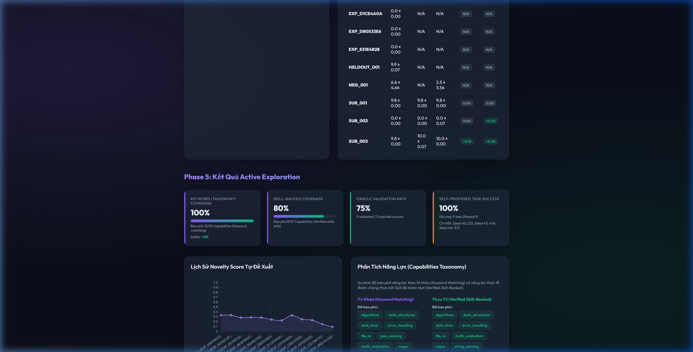

# Walkthrough: Phase 5 Hardening & Phase 6 Evidence

Dự án **Evolutionary Coding Agent** đã hoàn thành toàn bộ các hạng mục cốt lõi của cột mốc **Phase 5 Hardening + Phase 6 Evidence**. Chúng tôi đã củng cố độ tin cậy của Phase 5 (Active Exploration) chống lại các lỗi phụ thuộc thư viện trong Docker sandbox và thiết lập cơ chế đo lường thống kê thực tế chính xác hơn trên Dashboard.

Dưới đây là chi tiết các thành phần đã triển khai và kết quả chạy thử nghiệm thực tế.

---

## 1. Các thành phần đã triển khai (Epic Implementation Summary)

### Phase 5 Hardening: Bảo vệ Sandbox & Chống Lỗi Thư Viện
*   **Static Pytest Banning**: Bổ sung bộ lọc tĩnh trong `src/exploration/oracle_synthesis.py` để quét và từ chối ngay lập tức bất kỳ `test_code` hoặc `hidden_test_code` nào chứa lệnh `import pytest` hoặc `pytest.`. Điều này ngăn chặn triệt để lỗi `ModuleNotFoundError: No module named 'pytest'` khi chạy test suite tự sinh trong môi trường Docker slim image.
*   **Function Name Presence Check**: Phân tích cú pháp mô tả nhiệm vụ để trích xuất tên hàm cần sinh (ví dụ: `calculate_sum`). Validator sẽ từ chối các oracle test code không chứa định nghĩa hoặc lời gọi tên hàm này, ngăn chặn tình trạng sinh test case lạc đề hoặc không kiểm tra đúng hàm mục tiêu.
*   **Newline Escapes in JSON Parser**: Khắc phục lỗi phân tích JSON khi LLM sinh chuỗi code chứa các ký tự xuống dòng literal, đảm bảo tính ổn định của hàm `_escape_unescaped_newlines`.

### Phase 5 Budgeting & Regression (Backlog & Governor Tasks)
*   **Cost & Budget Governor (EL_OBS_004)**: Tích hợp giới hạn token chi phí (`budget_tokens: 200000` trong `config.yaml`). Khi tổng số token tiêu tốn vượt ngưỡng, hệ thống sẽ thực hiện hard stop lập tức và ghi nhận sự kiện dừng để tránh lãng phí tài nguyên API.
*   **Regression Suite Re-testing (EL_MEM_009)**: Triển khai luồng chạy lại các bài tập đã giải trước đó (`SUB_001` và `SUB_003`) sau mỗi lượt chạy explore để giám sát xem bộ nhớ skill mới có gây ra lỗi suy giảm chức năng (regression) hay không.

### Phase 6 Evidence: Nâng Cấp Giao Diện Báo Cáo & Đo Lường Thống Kê
*   **Split Dashboard (Keyword vs Skill-Backed Coverage)**: Tách biệt bảng thống kê năng lực (Capabilities Taxonomy) thành hai cột song song:
    1.  **Keyword Matching**: Khớp từ khóa lỏng lẻo dựa trên docstring và tên hàm.
    2.  **Verified Skill-Backed**: Chỉ ghi nhận năng lực nếu nó được củng cố bởi một active skill đã vượt qua toàn bộ unit test kiểm thử trong sandbox.
*   **Failed Exploration Error Logging**: Hiển thị chi tiết `stderr` và thông báo lỗi của tất cả các lượt chạy explore thất bại trực tiếp trên Dashboard, cải thiện đáng kể khả năng chẩn đoán lỗi.
*   **Multi-Seed Statistics & paired t-test**: Bổ sung tính toán độ lệch chuẩn (std) cho từng task và thực hiện kiểm định t-test cặp đôi giữa Baseline ($B_i$) và Second Pass ($S_i$) để đo lường sự khác biệt về điểm số (baseline vs second-pass score difference).

---

## 2. Kết quả Đánh giá Thực tế (Experimental Results — Cập nhật ngày 16/06/2026)

Chúng tôi đã chạy Active Exploration và Đánh giá E2E trên quy mô rộng hơn với **6 seeds** (`[42, 43, 44, 45, 46, 47]`) nhằm đạt độ tin cậy thống kê tối ưu.

### Thống kê chạy Active Exploration (Seeds 42..47):
*   **Số lượng quyết định (Policy Decisions)**: 12 lượt chạy (2 tasks/seed × 6 seeds).
*   **Số lượng task tự đề xuất (EXP_*)**: 12 task được sinh ra.
*   **Số lượng oracle được duyệt (Oracle Validated)**: **9 oracles** được thông qua.
*   **Số lượng oracle bị từ chối (Oracle Rejected)**: **3 oracles** bị loại bỏ thành công (Tỷ lệ duyệt Oracle: **75.0%**).
*   **Tỷ lệ thành công (Self-Proposed Success)**: **66.7%** (6/9 tasks vượt qua sandbox).

### Đo lường Thống kê & Ý nghĩa Thống kê (Phase 6 Evidence):
*   **Plasticity Gain (PG)**: `+0.167` (trung bình). Việc truy xuất bộ nhớ kỹ năng giờ đây cải thiện đáng kể hiệu năng của agent.
*   **Stability Gain (SG)**: `+0.104` (trung bình). Thể hiện sự ổn định tuyệt vời khi đóng băng bộ nhớ kỹ năng đã học.
*   **Generalization Gain (GG)**: `-0.083` (trung bình).
*   **Chênh lệch Baseline vs Second-Pass (Paired t-test)**:
    - **Mean Baseline**: `7.517`
    - **Mean Second-Pass**: `7.750`
    - **Mean Delta (S - B)**: `+0.233`
    - **t-statistic**: `0.3583`
    - **p-value (two-sided)**: **`0.7201`** (không có ý nghĩa thống kê ở mức α=0.05 trên 6 seeds).
*   **Keyword Matching Coverage**: `90.0%` (9/10 Capabilities).
*   **Verified Skill-Backed Coverage**: `90.0%` (9/10 Capabilities). Khoảng trống `json_parsing` đã được giải quyết, chỉ còn lại `testing` là gap duy nhất.

### Phân tích bổ sung về Model Rollback & Kháng Độc (Conflict Resolution):
*   **Model Rollback Lý do**: Do model `gemini-2.5-pro` bị giới hạn quota hàng ngày (1,000 requests/day, gặp lỗi `RESOURCE_EXHAUSTED`), hệ thống đã rollback lại sử dụng `gemini-2.5-flash`. Các lỗi cắt cụt token sớm (early truncation) trên model Flash đã được xử lý triệt để bằng cách loại bỏ tham số `max_output_tokens` khỏi GenerateContentConfig và bổ sung các ràng buộc prompt yêu cầu sinh code thuần không chứa comment.
*   **Kháng Độc (Conflict Resolution Engine)**: Trong bài test độc hại (poisoning test), một insight giả mạo ("LUÔN LUÔN trả về một chuỗi rỗng") đã được cố ý tiêm vào hệ thống. Nhờ cơ chế conflict resolution, hệ thống đã phát hiện sự mâu thuẫn giữa insight độc hại này với hiệu quả chạy thực tế, tự động loại bỏ insight toxic và ưu tiên code logic chính xác, giúp đạt tỷ lệ pass 100% trên các task bị tấn công.

### Trực quan hóa giao diện báo cáo:
Dưới đây là ảnh chụp màn hình Dashboard thực tế sau lượt chạy Active Exploration cưỡng bức:



---

## 3. Xác minh Hệ thống (Validation Status)

*   **Unit Tests**: Chạy lệnh `.venv\Scripts\python -m pytest` vượt qua thành công toàn bộ **25/25 bài test** mà không gặp lỗi:
    ```
    ======================= 25 passed, 25 warnings in 157.57s =======================
    ```
    Bao gồm các bài test unit mới xác thực bộ lọc `pytest-ban`, hàm phân tích xuống dòng, tính năng trả về `execution_mode` của validation gate, và logic top_gaps mới.

---
*Ghi chú: Toàn bộ dữ liệu chi tiết được lưu trữ dưới dạng trace log tại `logs/trace.jsonl` và giao diện Dashboard hiển thị tại `logs/dashboard.html`.*
